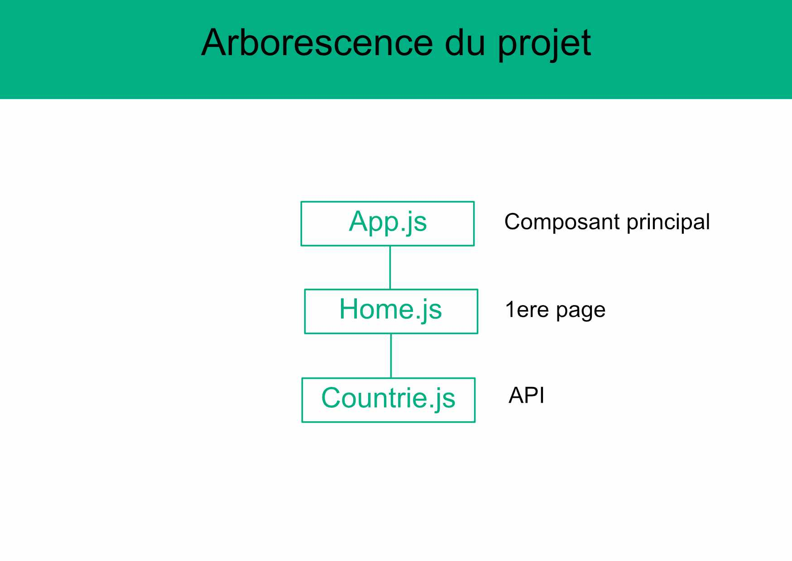

# General Info

Test Julie Lacresse délivré par Nexten.io
Avec la librairie React
Le 14/04/2021

---

# Arborescence

Reflexion sur l'arborescence de l'appli.
Il manque Continents et Languages en composant au même niveau que Countries.
Besoin d'une seule page.

# Prérequis

Avoir Node et NPM

# Création du projet

npx create-react-app nomduprojet

# Instalation des dépendances

npm i -s react-dom react-router-dom node-sass@4.14.1
npm install react react-dom @apollo/client graphql

# Lancer le projet

npm start

# Organisation

-> App gère toutes la pages de l'application, ici il n'y en a une seule...
Les composants sont regroupés dans un dossier 'components' dans des fichiers bien séparés.
-> Countries, languages et continents sont des composants.
Les fichiers de styles sont regroupés dans un dossier 'styles'.
